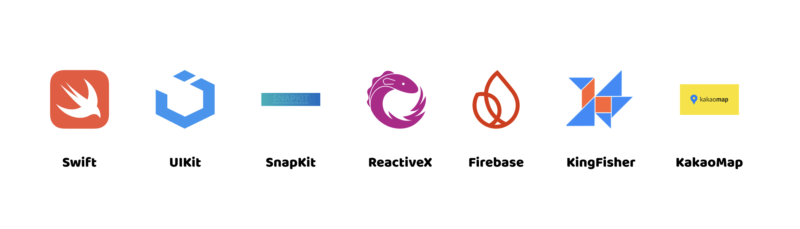
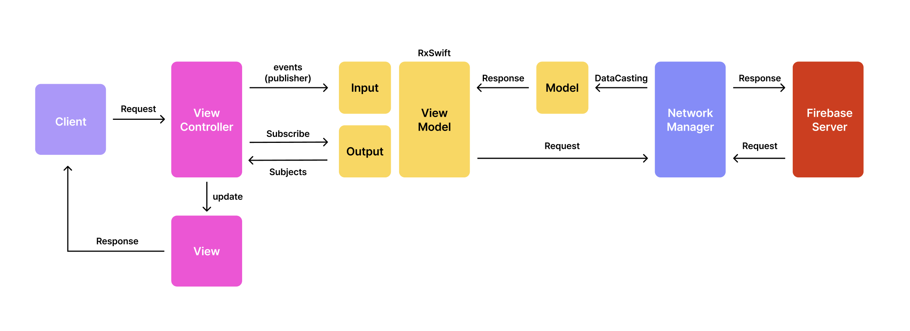

# PuppyTing

## 앱스토어
 
<a href="https://apps.apple.com/kr/app/%ED%8D%BC%ED%94%BC%ED%8C%85/id6670602342">앱스토어 다운로드</a>

## 프로젝트 소개
- 퍼피팅은 지역 기반의 커뮤티니 서비스를 통해 반려견과 함께 산책할 메이트를 쉽게 찾을 수 있는 iOS 어플리케이션입니다.
- 사용자는 퍼피팅을 통해 반려견과의 즐겁고 건강한 산책 경험을 이웃과 함께 공유할 수 있습니다.

## 팀원 구성
<table style="width: 100%; text-align: center; vertical-align: middle;">
    <tr style="font-weight: bold;">
        <td>김승희</td>
        <td>박승환</td>
        <td>전가혜</td>
        <td>김광현</td>
    </tr>
    <tr>
        <td>
            <a href="https://github.com/palrang22">
                 
                @palrang22
            </a>
        </td>
        <td>
            <a href="https://github.com/sh990920">
                 
                @sh990920
            </a>
        </td>
        <td>
            <a href="https://github.com/gahyejeon">
                 
                @gahyejeon
            </a>
        </td>
        <td>
            <a href="https://github.com/Leedoseo">
                 
                @Leedoseo
            </a>
        </td>
    </tr>
    <tr>
        <td>
            
        </td>
        <td>
            
        </td>
        <td>
            
        </td>
        <td>
            
        </td>
    </tr>
    <tr>
        <td>iOS</td>
        <td>iOS</td>
        <td>iOS</td>
        <td>iOS</td>
    </tr>
</table>

## 기술 스택

- 의존성 관리 도구 : SPM
- 형상 관리 도구 : GitHub, Git
- 아키텍처 : MVVM
- 디자인 패턴 : Singleton, Delegate, Observer
- 인터페이스 : UIKit
- 레이아웃 구성 : SnapKit 5.7.1
- 외부 저장소 : Firebase 11.2.0
- 외부 인증 : GoogleSignIn 8.0.0, KakaoOpenSDK 2.22.7
- 지도 : KakaoMapsSDK 2.10.5
- 이미지 처리 : Kingfisher 7.12.0
- 코드 스타일 : StyleShare - Swift Style Guide, SwiftAPI
- 네트워킹 : RESTful API

## 프로젝트 구조
### MVVM 아키텍처

## 이미지

## 주요 기능
### 🚶🏻‍♀️ 반려견 산책 메이트 찾기
사용자들은 커뮤니티를 통해 반려견과 함께 산책할 메이트를 쉽게 찾을 수 있습니다. 
간편한 게시글 작성 기능을 통해 자신의 산책 계획과 위치를 공유해 메이트를 구하는 내용을 공유할 수 있으며, 
이웃들과의 소통을 통해 더 즐겁고 안전한 산책 경험을 만들 수 있습니다.

### 💬 견주간 채팅 기능
퍼피팅 내에서는 사용자가 서로 직접 대화할 수 있는 채팅 기능이 제공됩니다. 이를 통해 산책메이트와 실시간 소통이 가능하며, 
만나기 전 서로의 반려견 정보나 산책 코스에 대한 논의 등을 간편하게 할 수 있습니다.

### 🐶 반려견 등록 및 관리
사용자는 앱 내에서 자신의 반려견을 등록하고, 반려견의 프로필을 관리할 수 있습니다. 
반려견의 이름, 나이, 특징, 프로필 사진 등의 다양한 정보를 입력하여 관리할 수 있으며, 
다른 견주들과 정보를 쉽게 교환할 수 있습니다.

<!-- ## 기술적 의사 결정
- **MVVM** : UI와 비즈니스 로직을 분리하여 유지보수성과 코드 가독성을 향상시키고, 
데이터 바인딩을 통해 UI 업데이트를 간편하게 처리할 수 있습니다.

- **Firebase FireStore** : 실시간 데이터 동기화, 간편한 설정, 화장성 들을 고려해서 선택하였습니다.

- **Firebase Realtime Database** : 손쉬운 설정과 관리 기능으로 개발 과정을 간소화하고, 
확장성을 높여 채팅 기능의 안정성을 보장하고 실시간 데이터 동기화를 간편하게 구현할 수 있습니다.

- **Kingfisher** : 이미지 로딩 중에 사용자 인터페이스가 멈추지 않도록 비동기 처리르 지원하여 부드러운 UI를 제공하고 있어 
퍼피팅 앱에서 이미지 로딩과 캐싱을 효과적으로 처리할 수 있습니다.

- **RxSwift** : 코드의 가독성을 향상시키고, 데이터 스트림과 이벤트를 쉽게 관리할 수 있도록 도와 효율적인 개발을 가능하게 합니다.

- **kakaoMapsSDK** : 간편한 API를 통해 다양한 지도 기능을 구현할 수 있으며,  
사용자 위치 기반 서비스를 지원하여 산책 메이트 찾기 기능을 효율적으로 강화하고, 
지도 위에 마커와 경로를 쉽게 표시할 수 있어 사용자가 원하는 정보를 직관적으로 제공받을 수 있습니다. -->

