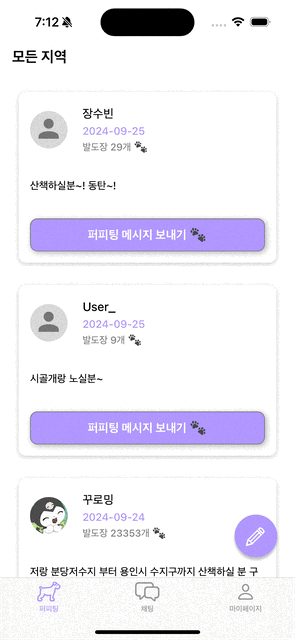

# PuppyTing

## 앱스토어
|  |  |
|:---:|:---:|
| <a href="https://apps.apple.com/kr/app/%ED%8D%BC%ED%94%BC%ED%8C%85/id6670602342">앱스토어로 다운받기</a> | QR코드로 다운받기 |

## 프로젝트 소개
- 퍼피팅은 지역 기반의 커뮤티니 서비스를 통해 반려견과 함께 산책할 메이트를 쉽게 찾을 수 있는 iOS 어플리케이션입니다.
- 사용자는 퍼피팅을 통해 반려견과의 즐겁고 건강한 산책 경험을 이웃과 함께 공유할 수 있습니다.

## 팀원 구성
| **김승희** | **박승환** | **전가혜** | **김광현** |
|:---:|:---:|:---:|:---:|
|  |  |  |  |
| [@palrang22](https://github.com/palrang22) | [@sh990920](https://github.com/sh990920) | [gahyejeon](https://github.com/gahyejeon) | [Leedoseo](https://github.com/Leedoseo) |
|  |  |  |  |
| iOS | iOS | iOS | iOS |

## 기술 스택

 
 

| **항목** | **사용 기술** |
|:---:|:---:|
| 의존성 관리 도구 | SPM |
| 형상 관리 도구 | GitHub, Git |
| 아키텍처 | MVVM |
| 디자인패턴 | Singleton, Delegate, Observer |
| 인터페이스 | UIKit |
| 레이아웃 구성 | SnapKit |
| 외부 저장소 | FireStore, RealtimeDatabase, FirebaseStorage |
| 외부 인증 | GoogleSignIn, FirebaseAuth |
| 지도 | KakaoMapsSDK |
| 이미지 처리 | Kingfisher |
| 네트워킹 | KakaoRESTApi |
| 협업툴 | Slack, Notion |

## 프로젝트 구조
### MVVM 아키텍처

## 시연 영상
 
영상링크 : https://www.youtube.com/watch?v=j2Jfukx8v9Y

## 주요 기능

### 로그인
|  |  |  |
|:---:|:---:|:---:|
| **소셜 로그인** | **회원가입** | **로그인** |

### 채팅
|  |
|:---:|
| **채팅 목록 & 채팅 보내기** |

### 피드
|  |  |  |  |
|:---:|:---:|:---:|:---:|
| **피드 메인화면 & 상세보기** | **퍼피팅 메세지 보내기** | **피드 신고 & 사용자 차단** | **피드 작성하기** |

### 마이페이지
|  |  |  |  |  |
|:---:|:---:|:---:|:---:|:---:|
| **내피드관리 & 즐겨찾기 & 차단목록관리** | **로그아웃** | **내정보 수정** | **강아지 추가 & 수정** | **고객지원 & FAQ & 공지사항** |

### 프로필
|  |  |  |
|:---:|:---:|:---:|
| **프로필 화면** | **빌도장 찍기** | **차단하기** |

### 🚶🏻‍♀️ 반려견 산책 메이트 찾기
> 사용자들은 커뮤니티를 통해 반려견과 함께 산책할 메이트를 쉽게 찾을 수 있습니다. 
간편한 게시글 작성 기능을 통해 자신의 산책 계획과 위치를 공유해 메이트를 구하는 내용을 공유할 수 있으며, 
이웃들과의 소통을 통해 더 즐겁고 안전한 산책 경험을 만들 수 있습니다.

### 💬 견주간 채팅 기능
> 퍼피팅 내에서는 사용자가 서로 직접 대화할 수 있는 채팅 기능이 제공됩니다. 이를 통해 산책메이트와 실시간 소통이 가능하며, 
만나기 전 서로의 반려견 정보나 산책 코스에 대한 논의 등을 간편하게 할 수 있습니다.

### 🐶 반려견 등록 및 관리
> 사용자는 앱 내에서 자신의 반려견을 등록하고, 반려견의 프로필을 관리할 수 있습니다. 
반려견의 이름, 나이, 특징, 프로필 사진 등의 다양한 정보를 입력하여 관리할 수 있으며, 
다른 견주들과 정보를 쉽게 교환할 수 있습니다.

## 트러블 슈팅

## 향후계획
